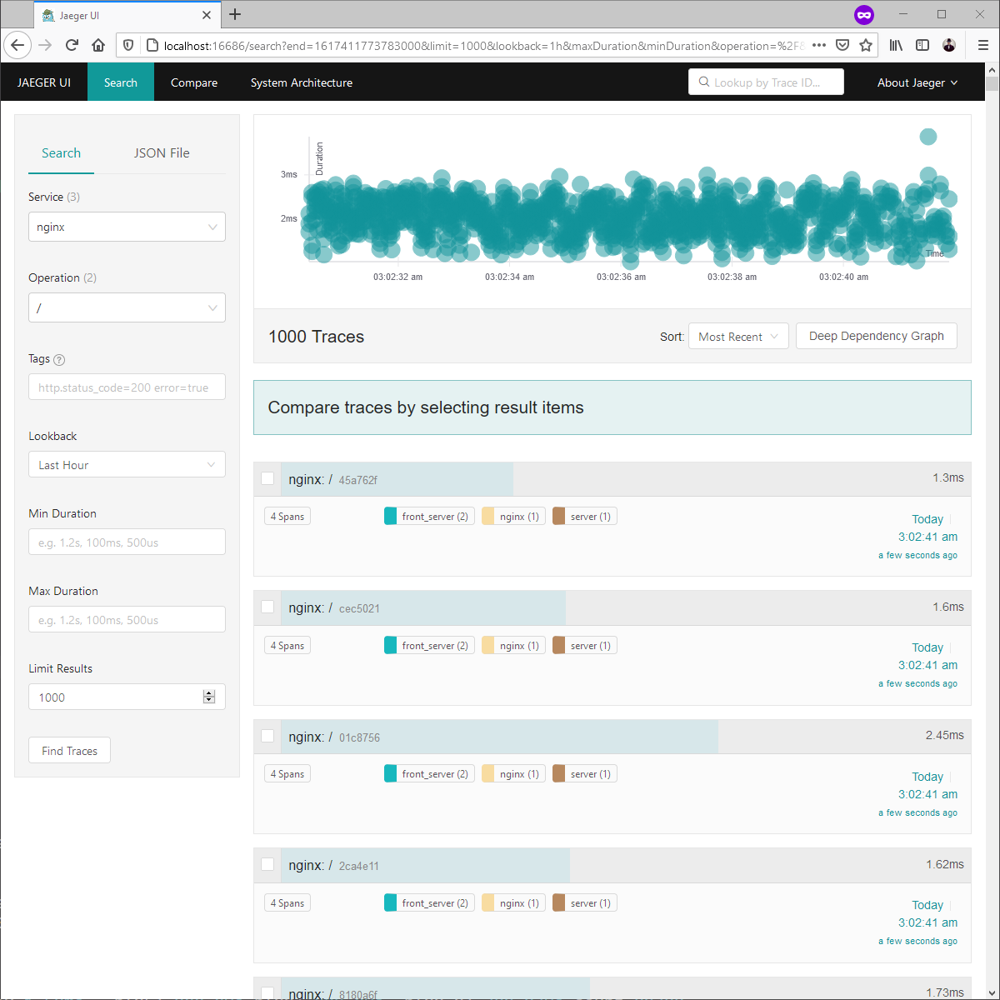
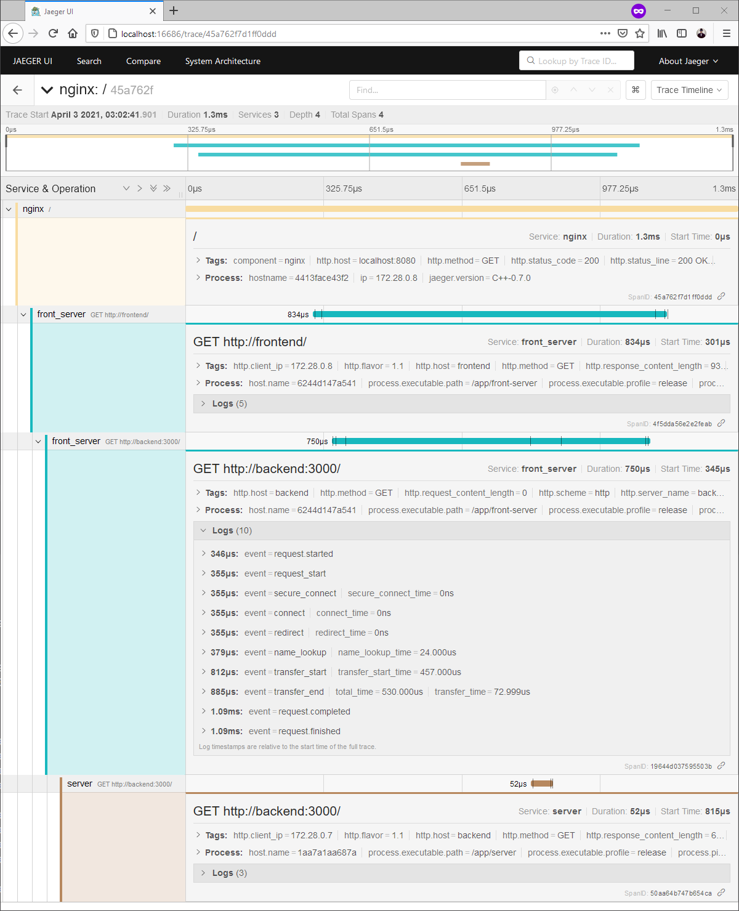
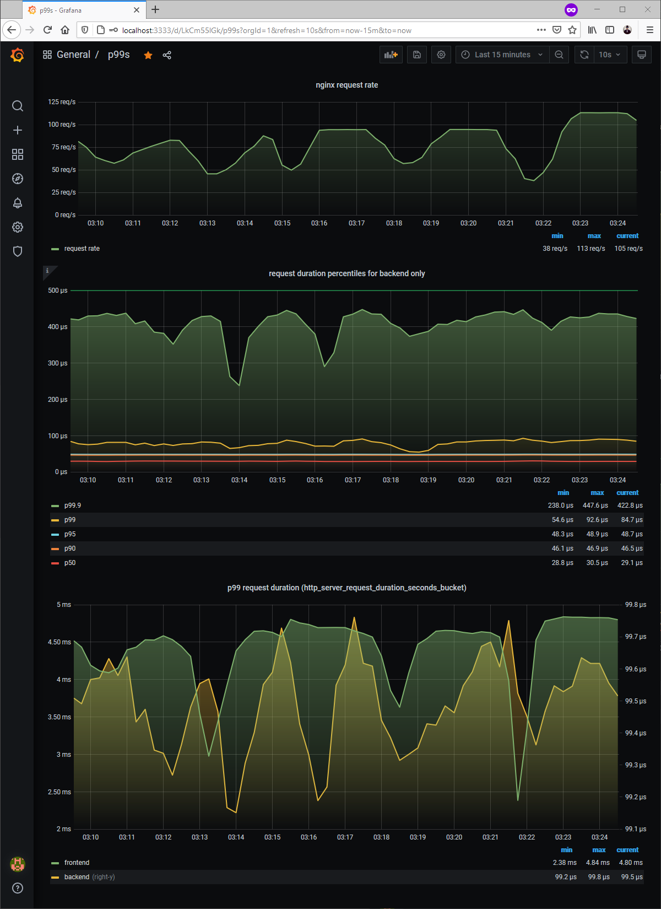

# surfing-the-tide

A _fullstack telemetry_ showcase.

```
Integration example of
  tide + opentelemetry-tide
with
  surf + opentelemetry-surf
```

On top of that, the whole docker-compose setup provides you with the following:

* nginx as the "ingress" service (public port 8080)
* tide based "frontend" servers (upstream of nginx)
* tide based "backend" servers (called via surf in frontend server)
* multiple frontends and backends for distribution and load balancing
* jaeger tracing pipeline with individual services (agent, collector, query UI)
* elasticsearch cluster for tracing data storage (3 nodes)
* prometheus service for metrics collection
* nginx-prometheus-exporter for basic nginx metrics
* grafana as a dashboard solution

Only nginx, jaeger query UI, and grafana are publicly exposed

_Why is there no logging facility in place?_

I believe we should rethink what, how, and why we log.
With tracing and properly emitted events via spans, we can achieve the same insights as our good old logs.
what we need is maybe a better way to access and/or postprocess those trace based log events. Also keep in mind that you need 100 % tracing, no downsampling allowed, otherwise you loose information. But if we replace our way of logging, then 100 % tracing might not be an issue after all.

The same goes for error reporting by the way. Nothing prevents you from attaching your beloved stacktraces to the span events if you so desire. Yet again, we "just" need better interfaces and integrations for that.

## Usage

```sh
# start all services (docker compose)
make dc.up

# Make a request or two ...
curl http://localhost:8080/

# Open browser and view the traces
firefox http://localhost:16686/
```

You should see traces with multiple spans, for nginx, the front(end)-server, and (backend) server.




As well as some metrics in grafana, too:


