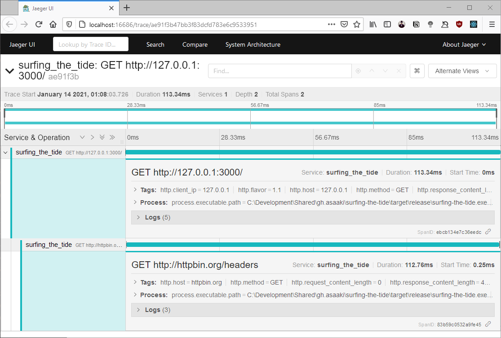

# surfing-the-tide

```
Integration example of
  tide + opentelemetry-tide
with
  surf + opentelemetry-surf
```

## Usage

```sh
# Run jaeger in background
docker run -d \
  -p6831:6831/udp -p6832:6832/udp -p16686:16686 -p14268:14268 \
  jaegertracing/all-in-one:latest

# Run the app
cargo run # --release

# Switch to another terminal

# Make a request or two ...
curl http://localhost:3000/

# Open browser and view the traces
firefox http://localhost:16686/
```

You should see traces with 2 spans, one for the tide request plus a nested one from the surf request:


